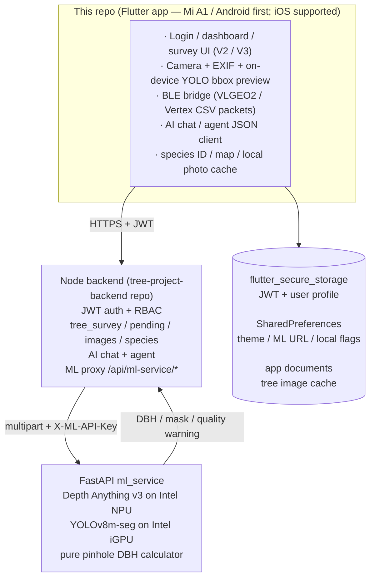

# sustainable_treeai (frontend)


Flutter app — field-survey, two-stage measurement, AR/CV-based DBH estimation,
project & area management, AI chat / agent, and on-device tree-trunk
preview. The single companion to the Node backend.

`pubspec.yaml`: `name: sustainable_treeai`, `version: 18.10.1+23`,
`environment.sdk: '>=3.0.0 <4.0.0'` (Flutter 3.x).

---

## Architecture overview



Static DBH measurement goes through the Node backend proxy:
`Flutter → /api/ml-service/* → FastAPI ml_service`. The Flutter client
sends only the app JWT; `X-ML-API-Key` is injected by the backend from its
environment. Older direct-ML/WebSocket code remains useful for live preview
experiments, but it is not the main persisted DBH path.

---

## Stack

| Concern              | Package(s) |
|----------------------|------------|
| HTTP                 | `http`, `dio` ^5.8 |
| Server-Sent Events   | `flutter_client_sse` ^2.0 (used by AI chat streaming) |
| Secure storage       | `flutter_secure_storage` ^9.0 (JWT + user profile) |
| Plain prefs          | `shared_preferences` ^2.2 (theme, AI userId, ML URL/key, environment) |
| State management     | `flutter_riverpod` ^2.3 (+ `riverpod_annotation`) **and** `provider` ^6.0 — both are present; older screens use `provider`, newer V3 screens use Riverpod |
| Maps                 | `google_maps_flutter` 2.10.0, `flutter_map` ^8.1, `latlong2` ^0.9 |
| Charts               | `fl_chart` ^0.71 |
| BLE                  | `flutter_blue_plus` **pinned to 1.32.0** (newer versions have a regression on Android 14) |
| Camera               | `camera` ^0.11.3 with `camera_android` **pinned to 0.10.9+16** to force the Camera2 backend. CameraX eagerly binds 3 use cases, but LEGACY-tier devices only support 2 |
| EXIF / focal length  | `exif` ^3.3 |
| On-device ML         | `tflite_flutter` ^0.12 (LiteRT 1.4) and `google_mlkit_object_detection` ^0.14 |
| Sensors / hardware   | `geolocator`, `sensors_plus`, `permission_handler`, `connectivity_plus`, `package_info_plus`, `device_info_plus` |
| Files / IO           | `file_picker`, `image_picker`, `path_provider`, `open_filex`, `excel`, `pdf` |
| QR / barcode         | `mobile_scanner` ^3.2 |
| Markdown             | `flutter_markdown` ^0.7 |
| WebSocket            | `web_socket_channel` ^3.0 (live ML scan mode) |
| Image preprocessing  | `image` 4.3.0 |
| Localization         | `intl` ^0.20 |
| LLM SDKs (optional)  | `google_generative_ai` ^0.2, `dart_openai` ^4.0 (most LLM calls actually go through the backend; these are kept for direct fallback) |

---

## Quick start

```bash
cd frontend
flutter pub get
flutter run                           # debug build on a connected device
flutter build apk --release           # Android release
flutter build appbundle --release     # Play Store bundle
flutter build ios --release           # requires macOS + Xcode
```

### 現場量測 Release 偵錯

現場連線頁（`BleLiveSessionPage`）**畫面底部日誌**在 release 亦會顯示；可點 AppBar **複製日誌**回報問題。

**本機 `flutter run` 終端機**（Debug 預設即有 `[BleLive]` / `[Pending]` 等行；可加 `--dart-define=ENABLE_FIELD_LOGS=true` 保險）：

```bash
flutter run --dart-define=ENABLE_FIELD_LOGS=true
```

若要同時寫入 **adb logcat**（接實機 release 除錯）：

```bash
flutter run --release --dart-define=ENABLE_FIELD_LOGS=true
# 或建 APK：
flutter build apk --release --dart-define=ENABLE_FIELD_LOGS=true
adb logcat -s BleLive FieldGPS Pending Maintain
```

文件與交接索引見 [`docs/HANDOFF.md`](docs/HANDOFF.md)。

The first run takes you to `LoginPage`. After login, JWT is written to
`flutter_secure_storage` under `auth_jwt_token`, and the user profile under
`user_info`.

---

## Configuration

### Environment / endpoints (`lib/config/app_config.dart`)

The previous Render staging / prod environments were retired in 2026-04, so
`Environment` now has **only one value**, `selfHosted`, which points to a
self-hosted base URL of the form:

```
https://<your-backend-host>/api
```

The actual hostname is set per-deployment in `app_config.dart` and is **not**
committed in clear text in this README — replace it with your own reverse
proxy / tunnel hostname before building. The `enum` is preserved so older
`SharedPreferences` keys still parse, and so a second environment can be
added later without renaming files.

### Self-signed TLS (`lib/main.dart`)

`SelfHostedHttpOverrides` whitelists self-signed certificates **only** for the
hosts supplied at build time via
`--dart-define=SELF_SIGNED_TRUSTED_HOSTS=<host1>,<host2>,...` (a `.`-prefixed
entry such as `.ts.net` trusts a whole tailnet suffix). Anything else uses
normal TLS validation. There is **no hard-coded host list and no global
override** — nothing personal is checked in. See `lib/main.dart` (header
comment) and `HANDOFF_SECRETS_CHECKLIST.md`.

### ML service (`lib/config/app_config.dart`)

The persisted DBH flow calls the Node backend ML proxy. `PureVisionDbhService`
uses `ApiService.baseUrl + '/ml-service'`, so requests are authenticated with
the normal app JWT and the backend keeps `ML_API_KEY` server-side. One prefs
key is still used for diagnostics / optional live scan URLs:

| `SharedPreferences` key | Purpose |
|-------------------------|---------|
| `self_hosted_ml_url`    | Optional ML host URL for diagnostics or experimental live scan |

`ml_api_key` is no longer persisted by the Flutter app; old values are removed
during configuration initialization. `ApiKeyManagementScreen` manages backend
API keys, not the ML service secret.

### Other prefs

| Key | Where |
|-----|-------|
| `environment` | `app_config.dart` (currently always `Environment.selfHosted`) |
| `ai_chat_user_id` | `main.dart` — persistent client-side userId so AI chat history survives restarts |
| `theme_mode` | `services/theme_service.dart` |

---

## Project layout (`lib/`)

```
main.dart                 Entry. SelfHostedHttpOverrides → AppConfig.initialize
                          → ApiService.initialize → CarbonSinkService preload
                          → ML data sync init → ThemeService init.
                          MaterialApp with ListenableBuilder(ThemeService) and
                          AuthGuard route map.
config/
  app_config.dart         baseUrl + ML URL + ML key (singleton)
  global_keys.dart        navigatorKey for cross-tree navigation
constants/                String tables, enum bridges
models/                   POCOs for tree, species, project, carbon, etc.
routes/
  auth_guard.dart         Redirects to /login when not authenticated
themes/
  app_theme.dart          ThemeData (light + dark)
screens/                  Top-level pages (see "Screens" below)
  v3/                     V3 manual-input + draw-boundary flow
services/                 API + on-device ML + storage wrappers
widgets/                  Reusable UI (chart cards, dialogs, tree-form parts)
utils/                    Pure functions (formatters, validators)
```

Top-level convenience pages (still imported by `main.dart` route map):
`tree_survey_page.dart`, `tree_input_page_v2.dart`, `tree_edit_page_v2.dart`,
`tree_survey_detail_page.dart`, `tree_list_page.dart`,
`project_trees_page.dart`, `statistics_page.dart`, `map_page.dart`,
`admin_page.dart`. New work goes under `screens/`.

### Screens (selected)

| File                              | Purpose |
|-----------------------------------|---------|
| `login_page.dart`                 | Username + password + login type ('admin'); calls `AuthService.login` |
| `home_page.dart`                  | Top tab shell (`HomePage`) and dashboard (`DashboardPage`) |
| `cities_page.dart`                | City / port browser |
| `project_areas_page.dart`         | Project-area CRUD; embedded `_ProjectsByAreaPage` |
| `manual_input_page_v2.dart` / `v3/manual_input_page_v3.dart` | Manual tree entry. V3 is the current default |
| `v3/integrated_tree_form_page.dart` | Composite tree form (geo + species + measurements) used after V3 photo capture |
| `v3/project_boundary_draw_page.dart` | Draw a project polygon on a map; POSTs to `/project-boundaries` |
| `scanner_page.dart`               | Live ML scan via WebSocket `/ws/scan` (DBH preview) |
| `species_identification_page.dart`| Image upload → backend `/species/identify` (PlantNet) |
| `pending_measurement_task_page.dart` | V3 two-stage workflow — review and transfer pending rows into `tree_survey` |
| `csv_import_page.dart`            | Multi-step CSV import (preview → execute) |
| `ai_chat_page.dart`               | AI chat (data path / knowledge path / agent toggle) |
| `ai_sustainability_report_screen.dart` | LLM-generated sustainability report viewer + PDF download |
| `ble_import_page.dart`            | Import measurements from BLE devices (`flutter_blue_plus`) |
| `ip_blacklist_page.dart`          | Admin: list / add / remove blacklisted IPs |
| `user_form_screen.dart`           | Admin: user CRUD + project assignment |
| `api_key_management_screen.dart`  | Admin: edit ML URL / API keys |
| `v3_services_page.dart`           | V3 utilities hub — image manager, conflict resolver |

### Services layer (`lib/services/`)

A single class per concern. Each one is a thin async wrapper that knows the
right URL path and JWT.

| File | Class | Responsibility |
|------|-------|----------------|
| `api_service.dart` | `ApiService` | Static `baseUrl` + JWT load/save in `flutter_secure_storage`. JWT is validated for ASCII + 3-segment base64url before use; corrupted tokens (Android keystore reset) are wiped instead of crashing. Common `get/post/put/delete/postMultipart` helpers |
| `auth_service.dart` | `AuthService` | Login, logout, persisted user info, role check, accessible-projects helpers (prefers new `projects[]` array, falls back to legacy `associated_projects` CSV) |
| `network_service.dart` | `NetworkService` | `connectivity_plus` listener; broadcasts online/offline state |
| `tree_service.dart`, `project_service.dart`, `project_area_service.dart`, `species_service.dart`, `user_service.dart`, `admin_service.dart`, `ai_service.dart`, `download_service.dart`, `pending_measurement_service.dart` | — | Domain wrappers around `ApiService` |
| `species_identification_service.dart` | — | `/species/identify` with multipart |
| `carbon_sink_service.dart` | — | Local cache of carbon-data species list (preloaded in `main`) |
| `carbon_calculation_service.dart` | `CarbonCalculationService` | Pure-Dart Chave 2014 allometric calculator; bundled wood-density tables for 80+ species (cross-referenced with Zanne et al. 2009 GWDD, IPCC 2006, ICRAF). Used as a client-side preview and in offline mode |
| `pure_vision_dbh_service.dart` | `PureVisionDbhService` | Singleton. Calls the FastAPI ML service: `/health`, `/measure-dbh`, `/auto-measure-dbh`, `/auto-measure-dbh-multi`, `/estimate-depth`, `/config`, `/debug/depth-at-point`. Sends `X-ML-API-Key`. Two-attempt retry on cold-start. EXIF focal-length pass-through |
| `tflite_tracking_service.dart` | — | On-device TFLite (LiteRT 1.4) inference for `tree_trunk_seg.tflite`. Used as the live preview while the user frames a tree |
| `scanner_service.dart` | — | WebSocket client for the live `/ws/scan` ML endpoint |
| `ar_measurement_service.dart` | `MeasurementPoint`, `MeasurementResult`, `DeviceCapabilities`, `ReferenceObject`, `ARMeasurementService` | Reference-object based DBH (e.g. an A4 sheet held next to the trunk) |
| `ble_packet_decoder.dart`, `ble_field_validator.dart`, `ble_data_processor.dart` | — | Parse raw BLE telemetry from the field measurement device |
| `location_service.dart` | — | `geolocator` wrapper with permission handling |
| `theme_service.dart` | — | `ChangeNotifier` for light/dark toggle, persisted to prefs |
| `services/v3/ml_data_sync_service.dart` | — | Background sync (every 30 min) of locally-collected ML training samples |

### On-device ML assets (`assets/ml/`)

| File | Notes |
|------|-------|
| `tree_trunk_seg.tflite` + `tree_trunk_labels.txt` | Custom YOLOv8n-seg trunk segmentation, used for the live preview overlay |
| `mobilenet_ssd.tflite` + `labels.txt` | MobileNet SSD, used as a generic fallback object detector |
| `mobilenet.zip` | Source weights archive (kept for reproducibility) |

The heavy depth + DBH inference always runs on the FastAPI server. The
TFLite models on-device are used only for the framing preview to avoid an
extra round-trip per camera frame.

### State management

The codebase uses **two** state-management libraries side by side:

- `provider` ^6.0 — older screens (`tree_survey_page.dart`,
  `tree_input_page_v2.dart`, etc.). `ChangeNotifier`-style.
- `flutter_riverpod` ^2.3 (+ `riverpod_annotation`) — V3 screens under
  `screens/v3/` and any new feature.

When adding a screen, prefer Riverpod. When editing legacy screens, keep
`provider` to avoid mixing both inside one widget tree.

### Networking

- Most calls go through `ApiService` (uses the `http` package).
- Multipart uploads (images, BLE imports, CSV imports) use `dio` for its
  better progress reporting.
- AI chat streaming uses `flutter_client_sse` against the SSE-compatible
  routes on the backend (`/api/agent/chat` is non-stream JSON; `/api/chat`
  has a streaming option toggled in the UI).

### Permissions / native config

Android (`android/app/src/main/AndroidManifest.xml`):
- `INTERNET`, `ACCESS_FINE_LOCATION`, `ACCESS_COARSE_LOCATION`, `CAMERA`,
  `RECORD_AUDIO` (camera plugin), `BLUETOOTH_SCAN`, `BLUETOOTH_CONNECT`,
  `READ_EXTERNAL_STORAGE` / `READ_MEDIA_IMAGES` (image picker),
  `POST_NOTIFICATIONS`.
- `camera_android` is pinned so Flutter loads Camera2 (not CameraX) on
  legacy devices that can only bind 2 use cases.

iOS (`ios/Runner/Info.plist`):
- `NSCameraUsageDescription`, `NSPhotoLibraryUsageDescription`,
  `NSLocationWhenInUseUsageDescription`,
  `NSBluetoothAlwaysUsageDescription`,
  `NSMotionUsageDescription` (`sensors_plus`).

---

## Build

```bash
flutter clean && flutter pub get
flutter build apk --release             # build/app/outputs/flutter-apk/app-release.apk
flutter build appbundle --release       # build/app/outputs/bundle/release/
flutter build ios --release --no-codesign
```

Versioning: bump `version: <name>+<code>` in `pubspec.yaml` before each
release. `<code>` (after `+`) becomes Android `versionCode` and iOS
`CFBundleVersion` and must increase monotonically.

App-launcher icons are generated from `assets/icons/` via:

```bash
flutter pub run flutter_launcher_icons
```

(see the `flutter_launcher_icons` block in `pubspec.yaml`).

---

## Testing

```bash
flutter test
```

Unit tests live under `test/`. There is no integration_test harness in this
repo today; manual QA is performed against the self-hosted backend
(see `docs/VERIFICATION_CHECKLIST.md`).

---

## Handoff / documentation

| 對象 | 文件 |
|------|------|
| 接手開發 | [`docs/HANDOFF.md`](docs/HANDOFF.md) |
| 機密備份 | [`docs/HANDOFF_SECRETS_CHECKLIST.md`](docs/HANDOFF_SECRETS_CHECKLIST.md) |
| 現場調查員 | [`docs/FIELD_SURVEY_SOP.md`](docs/FIELD_SURVEY_SOP.md) |
| 文件總索引 | [`docs/HANDOFF.md`](docs/HANDOFF.md) §10 文件地圖 |

本機備份至 `G:\`：`powershell -ExecutionPolicy Bypass -File scripts\handoff_backup.ps1`

> **業界慣例**：根目錄 README 保持精簡（入門 + 連結）；長篇手冊放 `docs/`，避免單一 README 過長難維護。

---

## License

MIT — see `LICENSE`.
