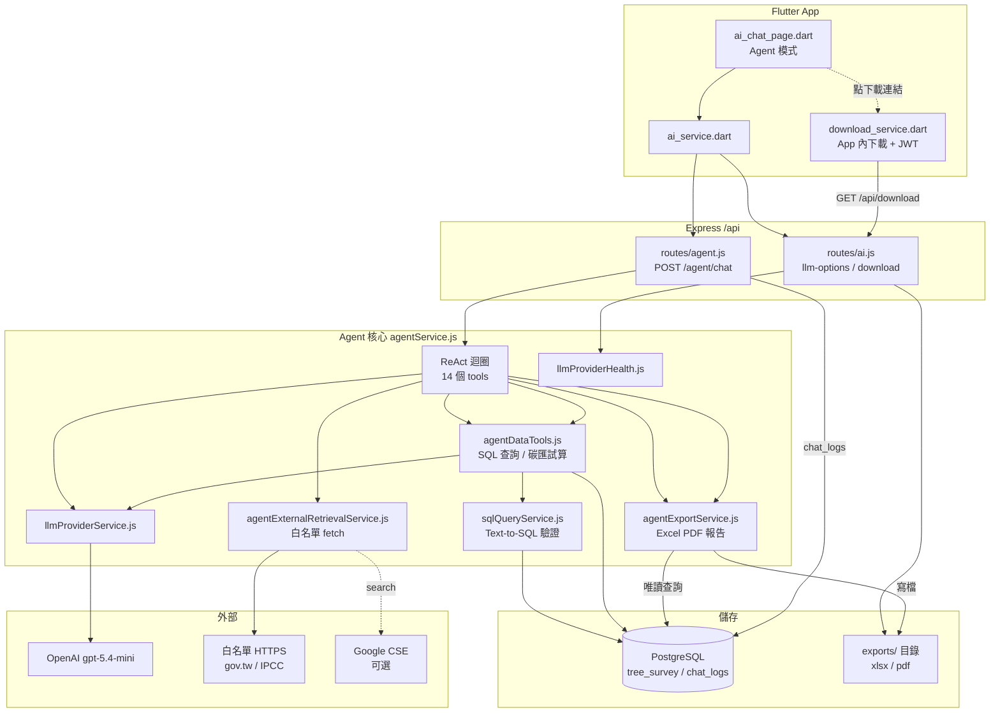

# 碳匯永續 AI Agent — 完整技術說明與 Demo 腳本

> **預設模型**：`gpt-5.4-mini`（Agent、Chat 備援、前端預設）  
> **版本定位**：v2 — 受控外部檢索 + 報表匯出（**無 RAG、不寫入 DB**）  
> **最後整理**：2026-05-22

---

## 一、Demo 問題清單（建議照順序，約 5～8 分鐘）

### A. 30 秒快打（手機／投影片開場）

| # | 直接貼上這句 | 預期 Agent 行為 |
|---|-------------|----------------|
| 1 | `列出可查的政策網站` | `list_policy_sources` 或 `list_demo_policy_urls` |
| 2 | `高雄港有多少棵樹` | 若無 DB 工具會引導匯出；可改問匯出 |
| 3 | `匯出高雄港樹木 Excel` | `export_excel` → 回傳 `downloadUrl` |

### B. 政策檢索（展示白名單 + 引用）

| # | 問題 | 預期工具 |
|---|------|----------|
| 4 | `環境部碳匯政策摘要` | `list_policy_sources` → `fetch_allowed_url`(moenv) |
| 5 | `比較環境部與林業署碳匯政策` | `fetch_allowed_urls`（2 個 gov 網址） |
| 6 | `IPCC 森林碳匯方法學摘要` | `fetch_allowed_url`(ipcc.ch) |
| 7 | `還能查哪些網站` | `list_allowed_domains` |

### C. 報表匯出（展示唯讀、下載連結）

| # | 問題 | 注意 |
|---|------|------|
| 8 | `匯出全部樹木 Excel` | 管理員可看全部；調查員僅授權專案 |
| 9 | `產生高雄港 AI 永續報告 PDF` | `export_ai_report`；較耗 token |
| 10 | `匯出台中港樹木 PDF` | 台中港若 0 筆會空檔，demo 優先用高雄港 |

### D. 進階（可選，論文／口試 Q&A）

| # | 問題 |
|---|------|
| 11 | `https://www.moenv.gov.tw/ 上有什麼碳匯相關資訊`（貼完整 URL） |
| 12 | `森林類的政策入口有哪些`（帶 category） |
| 13 | `統計各專案區位樹木數量並匯出 Excel` |

### Demo 禁忌（避免現場翻車）

- 不要問「碳權一噸多少錢」（系統 prompt 拒絕定價）
- 不要依賴 `search_public_documents`（需 GOOGLE_CSE，目前可略）
- 台中港若資料為 0，改 **高雄港** 或 **全部**

---

## 二、架構總覽



---

## 三、檔案清單與職責

| 路徑 | 職責 |
|------|------|
| `backend/routes/agent.js` | HTTP：`POST /agent/chat`、`GET /agent/status`、`GET /agent/models` |
| `backend/services/agentService.js` | ReAct 迴圈、合併 14 工具、system prompt、token 預算 |
| `backend/services/agentDataTools.js` | `query_tree_data`、`project_summary`、碳匯試算等資料工具 |
| `backend/services/sqlQueryService.js` | Agent／Chat 共用的安全 SQL 產生與執行 |
| `backend/services/agentExternalRetrievalService.js` | 網域白名單、單頁/批次抓取、政策目錄、CSE 搜尋（可選） |
| `backend/services/agentExportService.js` | Excel / PDF / AI 永續報告匯出 → `exports/` |
| `backend/services/llmProviderService.js` | SiliconFlow → OpenAI 備援、模型降級鏈 |
| `backend/services/llmProviderHealth.js` | 供應商探測、前端模型目錄、`gpt-5.4-mini` 預設 |
| `backend/routes/ai.js` | `GET /ai/llm-options`、`GET /download/:filename` |
| `backend/app.js` | `apiRouter.use('/agent', agentRoutes)` |
| `frontend/lib/screens/ai_chat_page.dart` | Agent/Chat 切換、模型選單、建議句、工具結果 UI |
| `frontend/lib/services/ai_service.dart` | `getAgentResponse`、`getLlmOptions` |
| `frontend/lib/services/download_service.dart` | Agent 匯出連結 App 內下載（勿開 Chrome） |
| `backend/database/initial_data/04_chat_logs_agent_mode.pg.sql` | `chat_logs.chat_mode`、`metadata` |
| `backend/scripts/test_agent_v2.js` | 端對端 smoke test |
| `backend/scripts/test_agent_mobile_demo.js` | 手機 API 路徑測試 |
| `backend/scripts/check_agent_status.js` | 狀態檢查 |

---

## 四、API 規格

### 4.1 `POST /api/agent/chat`

- **權限**：`requireRole('調查管理員')`（JWT）
- **Rate limit**：30 次 / 10 分鐘 / 使用者
- **Body**：
  ```json
  {
    "message": "匯出高雄港樹木 Excel",
    "sessionId": "可選",
    "model": "gpt-5.4-mini"
  }
  ```
- **Response**：
  ```json
  {
    "response": "Markdown 文字含下載連結",
    "sessionId": "agent_{userId}_{ts}",
    "toolCalls": [{ "tool": "export_excel", "args": {}, "resultSummary": { "downloadUrl": "..." } }],
    "tokensUsed": 1234,
    "model": "gpt-5.4-mini"
  }
  ```
- **限制**：訊息最多 2000 字；歷史最多 5 輪（`chat_mode = 'agent'`）

### 4.2 `GET /api/agent/status`

回傳：`available`、`tokenBudget`、`providers`、`tools[]`、`defaultModel`、`showModelPicker`

### 4.3 `GET /api/ai/llm-options`

回傳可用模型分類、`demoHints`、供應商健康狀態（快取 5 分鐘）

### 4.4 `GET /api/download/:filename`

匯出檔下載（`exports/` 目錄，Agent 產生的 xlsx/pdf）

---

## 五、ReAct 執行流程（`runAgent`）

1. `checkTokenBudget(userId)` — 每小時 50,000 tokens（表 `agent_token_usage`）
2. 組 `messages`：system prompt + 最近 5 筆歷史 + 使用者訊息
3. **迴圈最多 8 步**（`MAX_AGENT_STEPS`）：
   - `chatCompletions({ model, tools: AGENT_TOOLS, tool_choice: 'auto' })`
   - 無 `tool_calls` → 回傳最終文字
   - 有 `tool_calls` → `executeToolCall` → 結果以 `role: 'tool'` 塞回 messages
4. SiliconFlow 403/401/429 → 自動改 OpenAI（`useSiliconFlowFirst = false`）
5. 工具結果 JSON 截斷至 4000 字元；`data` 陣列最多 50 筆進 context
6. 第一步若 LLM 空回／拒答 → 重試引導「請使用工具…」

---

## 六、工具一覽（14 個）

| 工具名 | 模組 | 說明 |
|--------|------|------|
| `query_tree_data` | data | 自然語言 → 安全 SQL 查 tree_survey |
| `project_summary` | data | 各區位樹木／碳儲存統計 |
| `species_carbon_info` | data | 樹種碳參數或調查統計 |
| `calculate_carbon` | data | 單株碳儲存試算（手冊／TIPC） |
| `carbon_credit_estimate` | data | 專案碳儲存／年吸碳估算（非市場價） |
| `list_policy_sources` | external | 分類政策入口（環境/森林/農業/國際） |
| `list_demo_policy_urls` | external | 扁平入口列表（相容舊名） |
| `list_allowed_domains` | external | 白名單規則說明 |
| `fetch_allowed_url` | external | 單一 HTTPS 頁面 → 段落 + `citation` |
| `fetch_allowed_urls` | external | 2～3 URL 批次比較 |
| `search_public_documents` | external | Google CSE（**未設定則回 error + hint**） |
| `export_excel` | export | `tree_survey` → xlsx |
| `export_pdf` | export | 前 80 筆摘要 pdf |
| `export_ai_report` | export | 呼叫 `aiReportController` 產 AI 永續 PDF |

### 仍不支援

- RAG 向量檢索、Agent 直接寫入／刪除資料庫

---

## 七、外部檢索白名單

### 7.1 網域後綴 `ALLOWED_HOST_SUFFIXES`

`.gov.tw`、`.edu.tw`、`moenv.gov.tw`、`forestry.gov.tw`、`coa.gov.tw`、`ipcc.ch`、`unfccc.int`、`fao.org`、`iges.or.jp` 等。

### 7.2 內建政策目錄 `POLICY_SOURCE_CATALOG`

- **環境與氣候**：環境部、碳足跡平台、法規系統  
- **森林與國土**：林業署、森林經營及保育處、農業部  
- **能源與產業**：國發會、能源署  
- **國際方法學**：IPCC、UNFCCC、NGGIP、FAO  

### 7.3 抓取限制

| 環境變數 | 預設 | 意義 |
|----------|------|------|
| `AGENT_FETCH_TIMEOUT_MS` | 15000 | HTTP 逾時 |
| `AGENT_FETCH_MAX_BYTES` | 500000 | 單頁大小上限 |
| `AGENT_FETCH_CACHE_TTL_MS` | 24h | 記憶體快取 |
| `AGENT_EXTRA_HOST_SUFFIXES` | — | 額外後綴，逗號分隔 |

HTML → 純文字最多約 12000 字；PDF 僅回連結不解析全文。

---

## 八、匯出與權限（`agentExportService`）

- **目錄**：`backend/exports/`  
- **下載 URL**：`{BASE_URL 或 TEST_BASE_URL}/api/download/{fileName}`  
- **專案篩選**：
  - 系統/業務管理員：可指定 `project_area` / `project_codes` 或全部  
  - 調查管理員：`getUserProjects(userId)` 過濾  

---

## 九、LLM 與模型 `gpt-5.4-mini`

| 設定 | 值 |
|------|-----|
| `AGENT_DEFAULT_MODEL` | `gpt-5.4-mini` |
| `LLM_OPENAI_FALLBACK_MODEL` | `gpt-5.4-mini` |
| 前端預設 | `gpt-5.4-mini` |
| 降級鏈 | `gpt-5.4-mini` → `gpt-5-*` 失敗 → `gpt-4o-mini` |

### 可選模型（OpenAI 可用時）

1. **gpt-5.4-mini** — 預設，Agent / Demo  
2. gpt-5-mini — 最便宜  
3. gpt-5.4 — 較強推理  
4. gpt-5.5 — 最強（最貴）

### 供應商現況（伺服器典型）

| 供應商 | 狀態 |
|--------|------|
| OpenAI | 可用 |
| SiliconFlow | 403 身份驗證 |
| Gemini | Android key 限制 |

`GET /ai/llm-options` 會隱藏不可用供應商；`OPENAI_CATALOG_GPT5` 預設顯示 GPT-5 系列。

---

## 十、資料庫

### `chat_logs`（Agent 相關欄位）

- `chat_mode`：`'agent'` | `'chat'`  
- `metadata`：JSONB，`toolCalls`、`tokensUsed`  
- `model_used`：例如 `gpt-5.4-mini`  

### `agent_token_usage`

- `user_id` PK  
- `tokens_used`、`window_start`（滾動 1 小時）  

---

## 十一、前端整合

- **頁面**：`ai_chat_page.dart`，`_isAgentMode = true` 預設  
- **API**：`POST agent/chat`，可省略 `model`（後端用 `gpt-5.4-mini`）  
- **模型 UI**：`initState` → `getLlmOptions()`；Agent 且僅一供應商時顯示固定徽章  
- **建議句**：來自 `demoHints` 或內建四則  
- **工具 UI**：`toolCalls` → 摺疊顯示工具名與 `resultSummary.downloadUrl`  

### App API Base

`https://<TAILSCALE_HOST>/api`（Tailscale；自簽憑證需 `SelfHostedHttpOverrides`）

---

## 十二、環境變數速查

```env
OPENAI_API_KEY=sk-...
AGENT_DEFAULT_MODEL=gpt-5.4-mini
LLM_OPENAI_FALLBACK_MODEL=gpt-5.4-mini
TEST_BASE_URL=https://<TAILSCALE_HOST>/api
BASE_URL=https://<TAILSCALE_HOST>

# 可選
GOOGLE_CSE_API_KEY=
GOOGLE_CSE_CX=
AGENT_EXTRA_HOST_SUFFIXES=.tipc.gov.tw
OPENAI_CATALOG_GPT5=1
LLM_HEALTH_CACHE_MS=300000
```

---

## 十三、部署與測試

```bash
# 伺服器
cd /opt/tree-app/backend
pm2 reload tree-backend
node scripts/test_llm_health.js
node scripts/test_agent_v2.js
node scripts/check_agent_status.js
```

本機 Flutter：重新 build 後安裝，確認 AI 頁模型顯示 **GPT-5.4 mini · 預設**。

---

## 十四、論文／口試可強調的設計點

1. **ReAct + Function Calling**：工具選擇由 LLM 決定，非固定腳本。  
2. **受控外部檢索**：白名單網域，避免任意爬蟲與幻覺 URL。  
3. **可引用（citation）**：政策回答需附來源與擷取日期。  
4. **唯讀保證**：無 INSERT/UPDATE/DELETE 工具；匯出僅寫 `exports/`。  
5. **多層降級**：SiliconFlow → OpenAI；`gpt-5.4-mini` → `gpt-4o-mini`。  
6. **成本控管**：每使用者每小時 token 預算 + rate limit。

---

## 十五、相關路由掛載（`app.js`）

```javascript
apiRouter.use('/agent', agentRoutes);
```

完整路徑前綴：`/api/agent/*`、 `/api/ai/llm-options`、 `/api/download/*`。
